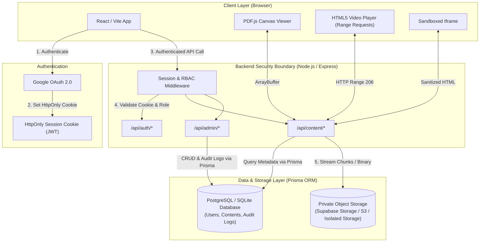

# Secure Content Portal

A full-stack, security-first internal organization portal for sharing training and reference content (MP4 Videos, PDFs, HTML interactive modules) with Role-Based Access Control (RBAC), private object storage, protected Range video streaming, canvas-rendered PDF viewing, and sandboxed HTML rendering.

---

## 1. Project Overview

The **Secure Content Portal** addresses a common enterprise security challenge: sharing internal training and reference documentation without exposing predictable, public, or guessable file download URLs (e.g. `/uploads/training_video.mp4` or public S3 bucket URLs).

All stored objects are kept **strictly private**. The backend acts as an authenticated security boundary: users access content through Express.js streaming endpoints that verify identity, session validity, and role permissions before streaming byte chunks or delivering binary payloads directly from private storage.

---

## 2. Key Features

- **Google OAuth 2.0 & Session Management**:
  - Secure single-sign-on via Google OAuth 2.0.
  - HttpOnly, SameSite, and Secure session cookie handling (no auth tokens stored in `localStorage`).
- **Server-Side Role-Based Access Control (RBAC)**:
  - Strict role enforcement (`ADMIN` vs `VIEWER`).
  - Automatic admin elevation via `ADMIN_EMAIL` environment variable check.
  - Reusable Express middleware (`requireAuth`, `requireAdmin`).
- **Protected Content Delivery**:
  - **HTTP Range Video Streaming**: Serves MP4 video in `206 Partial Content` byte chunks without exposing underlying storage URLs or loading full files into server memory.
  - **PDF.js Canvas Renderer**: Binary PDF delivery (`application/pdf`) rendered directly to HTML5 canvas. Standard print and download options are hidden.
  - **Sandboxed HTML Preview**: Interactive HTML training modules rendered within `<iframe sandbox="allow-scripts">` and sanitized on upload to prevent script execution against the host application context.
- **Admin Management Console**:
  - Drag-and-drop file upload with strict MIME type, file extension, and file size validation.
  - Metadata updates without re-uploading file binaries.
  - Safe, multi-step delete confirmation that purges objects from private storage and database simultaneously.
  - Full system audit trail logging (`UPLOAD`, `EDIT`, `DELETE`).
- **Viewer Portal**:
  - Content discovery dashboard with real-time search, category filtering, and content type pills (`VIDEO`, `PDF`, `HTML`).
  - View count tracking and responsive grid layout.

---

## 3. Technology Stack

- **Frontend**: React 18, Vite, React Router v6, PDF.js (`pdfjs-dist`), Lucide React icons, Modern Vanilla CSS design system.
- **Backend**: Node.js 26, Express.js 4, Prisma ORM 5, `jsonwebtoken`, `multer`, `@aws-sdk/client-s3`.
- **Database**: PostgreSQL / SQLite (managed via Prisma ORM).
- **Storage**: S3-compatible private object storage (AWS S3 / Supabase Storage) with local isolated fallback (`./private_storage`).

---

## 4. System Architecture



---

## 5. Project Structure

```
secure-content-portal/
├── backend/
│   ├── prisma/
│   │   └── schema.prisma
│   ├── src/
│   │   ├── server.js
│   │   ├── app.js
│   │   ├── config/
│   │   │   ├── env.js
│   │   │   └── prisma.js
│   │   ├── middleware/
│   │   │   ├── auth.js
│   │   │   ├── upload.js
│   │   │   └── errorHandler.js
│   │   ├── routes/
│   │   │   ├── auth.routes.js
│   │   │   ├── content.routes.js
│   │   │   └── admin.routes.js
│   │   ├── controllers/
│   │   │   ├── auth.controller.js
│   │   │   ├── content.controller.js
│   │   │   └── admin.controller.js
│   │   ├── services/
│   │   │   ├── auth.service.js
│   │   │   ├── content.service.js
│   │   │   └── storage.service.js
│   │   └── utils/
│   │       └── security.js
│   ├── tests/
│   │   └── api.test.js
│   ├── package.json
│   └── secure_content_portal.db
├── frontend/
│   ├── src/
│   │   ├── components/
│   │   │   ├── Navbar.jsx
│   │   │   ├── Sidebar.jsx
│   │   │   └── ProtectedContent/
│   │   │       ├── VideoPlayer.jsx
│   │   │       ├── PdfViewer.jsx
│   │   │       └── HtmlViewer.jsx
│   │   ├── context/
│   │   │   └── AuthContext.jsx
│   │   ├── pages/
│   │   │   ├── LoginPage.jsx
│   │   │   ├── DashboardPage.jsx
│   │   │   ├── ContentDetailPage.jsx
│   │   │   ├── AdminPage.jsx
│   │   │   ├── AdminUploadPage.jsx
│   │   │   └── AdminEditPage.jsx
│   │   ├── services/
│   │   │   └── api.js
│   │   ├── App.jsx
│   │   ├── main.jsx
│   │   └── index.css
│   ├── package.json
│   ├── vite.config.js
│   └── index.html
├── .env.example
├── .gitignore
└── README.md
```

---

## 6. Local Setup & Installation

### Prerequisites
- Node.js 18+ and `npm`

### Environment Configuration
1. Clone the repository:
   ```bash
   git clone <repository-url>
   cd secure-content-portal
   ```
2. Copy `.env.example` to `.env`:
   ```bash
   cp .env.example .env
   ```

---

## 7. Environment Variables Reference

| Variable | Description | Example / Default |
| :--- | :--- | :--- |
| `ENVIRONMENT` | Environment mode | `development` or `production` |
| `FRONTEND_URL` | Allowed frontend origin for CORS & cookies | `http://localhost:5173` |
| `BACKEND_URL` | Public backend URL | `http://localhost:8000` |
| `SESSION_SECRET` | Secret key for signing session JWT tokens | `super-secret-key-min-32-chars` |
| `COOKIE_SECURE` | Set `true` in production HTTPS environments | `false` (in dev) |
| `DATABASE_URL` | Prisma PostgreSQL or SQLite URI | `file:./secure_content_portal.db` |
| `ADMIN_EMAIL` | Dedicated admin Google account email | `admin@example.com` |
| `ADMIN_EMAILS` | Comma-separated list of admin email allow-list | `admin@example.com` |
| `GOOGLE_CLIENT_ID` | Google OAuth Client ID | `xxx.apps.googleusercontent.com` |
| `GOOGLE_CLIENT_SECRET` | Google OAuth Client Secret | `GOCSPX-xxx` |
| `GOOGLE_REDIRECT_URI` | Google OAuth Redirect URI | `http://localhost:8000/api/auth/google/callback` |
| `STORAGE_BUCKET` | S3 bucket name | `secure-portal-content` |

---

## 8. Database Setup (Prisma ORM)

To generate the Prisma Client and synchronize the database schema:

```bash
cd backend
npx prisma generate
npx prisma db push
```

---

## 9. Google OAuth 2.0 Setup

1. Go to [Google Cloud Console](https://console.cloud.google.com/).
2. Create a new project and configure the **OAuth consent screen**.
3. Create **OAuth 2.0 Client IDs** (Web application).
4. Add Authorized JavaScript origins: `http://localhost:5173` (and production domain).
5. Add Authorized redirect URIs: `http://localhost:8000/api/auth/google/callback` (and production API domain).
6. Copy Client ID & Client Secret into your `.env` file.
7. Configure `ADMIN_EMAIL=your-admin-email@gmail.com` in your backend `.env` file. Users authenticating with this email address will be automatically assigned the `ADMIN` role; all other authenticated accounts receive the `VIEWER` role.

---

## 10. Storage Setup (S3 / Supabase / Local Fallback)

- **Supabase Storage / S3**: Set `STORAGE_ACCESS_KEY`, `STORAGE_SECRET_KEY`, and `STORAGE_ENDPOINT` in `.env`.
- **Local Private Storage**: If S3 credentials are left empty, the application automatically uses an isolated directory (`backend/private_storage/`) outside public web roots.

---

## 11. Running the Application

### Running Backend Server (Express)
```bash
cd backend
npm start
# Or for auto-reloading dev mode:
npm run dev
```
Backend API server runs at `http://localhost:8000`. Health check is available at `http://localhost:8000/api/health`.

### Running Frontend Development Server (React)
```bash
cd frontend
npm run dev
```
Access the application at `http://localhost:5173`.

---

## 12. Automated Testing

To run the backend Jest / Supertest test suite (21 unit and integration tests covering auth, RBAC, delivery, storage, and range streaming):

```bash
cd backend
npm test
```

---

## 13. Security Architecture & Content Protection

1. **No Permanent Public URLs**: Objects are stored under unguessable UUID storage keys (`content/{uuid}/{filename}`). Files are never exposed via public bucket URLs.
2. **Authenticated Delivery**: All content endpoints (`/stream`, `/pdf`, `/html`) require valid session cookies.
3. **Range Video Streaming**: `GET /api/content/:id/stream` handles `Range: bytes=X-Y` headers, returning `206 Partial Content` chunk by chunk.
4. **PDF.js Canvas Rendering**: PDF data is loaded via array buffers and rendered directly to HTML5 canvas elements. Standard print and download options are suppressed.
5. **Sandboxed HTML**: HTML content is sanitized on upload and rendered inside `<iframe sandbox="allow-scripts">` to prevent DOM tampering or script access to session cookies.

---

## 14. RBAC & Administrative Security

- **Server-Side Boundary**: All administrative operations (`POST`, `PATCH`, `DELETE` on `/api/admin/*`) enforce the `requireAdmin` Express middleware.
- **Admin Allow-List**: User role is determined on login strictly by comparing the authenticated email against the `ADMIN_EMAIL` allow-list. Frontend role indicators are purely cosmetic.
